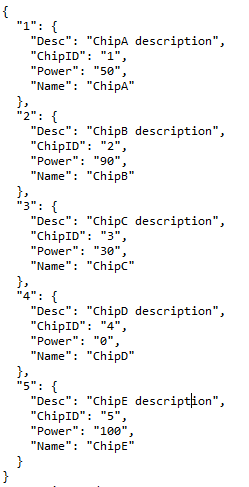

# Wczytywanie danych w R

## Formaty danych 

### CSV/DSV
CSV (Comma Separated Values) to plik tekstowy, w którym wartości rozdzielane są przecinkami, a kolejne wiersze znakiem nowej linii. Plik CSV zazwyczaj przechowuje dane tabelaryczne. Nagłówki kolumn są często dołączane jako pierwszy wiersz (są to nazwy zmiennych), a każdy kolejny wiersz odpowiada jednej obserwacji (jednemu wierszowi w tabeli danych).

CSV jest szczególnym przypadkiem formatu danych o nazwie Delimiter Seperated Values (DSV). Jest to plik tekstowy w którym pola w każdym wierszu oddzielone są dowolnym separatorem. Najczęściej spotykane separatory to: przecinek (CSV), tabulator (TSV), średnik.   

**Przykładowy plik CSV**          

            


### XML
XML to skrót od nazwy Extensible Markup Language. Dane przechowywane w tym formacie mają zagnieżdżoną strukturę: znaczniki oznaczają nazwy zmiennych, a wewnątrz przechowywane są ich wartości. XML swoją strukturą przypomina plik HTML.

**Przykładowy plik XML**         

          


### JSON
JSON - JavaScript Object Notation - to format przydatny w przypadku pracy z danymi pochodzącymi z REST API, czyli pobieranymi z sieci. Niektóre bazy danych również komunikują się za pomocą tego formatu, np. MongoDB.        

Struktura: w pliku JSON obserwacje przechowywane są w słownikach, w których nazwy zmiennych są kluczami, a wartości zmiennych - wartościami. Obserwacje oddzielane są przecinkami, a dodatkowo, wszystkie dane spięte są nawiasami klamrowymi.
           
           
**Przykładowy plik JSON**         




### Excel (XLSX)
XLSX to format danych oparty na XML. Pliki tego typu są domyślnymi dokumentami wyjściowymi arkuszy kalkulacyjnych programu Microsoft Excel. Przedstawiają one głównie dane liczbowe i tekstowe w postaci tabel dwuwymiarowych.

**Przykładowy arkusz kalkulacyjny w Excelu**                

{width=60%}


### Otwarte wersje programu Excel
Istnieją inne pakiety biurowe, np. LibreOffice, które - w przeciwieństwie do Excela - pozwalają na darmowe korzystanie z arkusza kalkulacyjnego. W przypadku LibreOffice, domyślnym formatem zapisu danych przez Calc (odpowiednik Excela) jest OpenDocument Format (.ods).        


**Przykładowy arkusz kalkulacyjny w LibreOffice**                  

{width=60%}


### Pliki tekstowe


Jednym z najczęściej występujących i najbardziej uniwersalnych formatów przechowujących dane (np. w postaci tabeli) są pliki tekstowe. Mają one najczęściej rozszerzenie ```txt``` lub ```csv``` (*comma separated values*).  
Poniższą charakteryzację różnych metod wczytywania przedstawiamy na podstawie pliku ```listings.csv```

#### Base   


Podstawową funkcją używaną do wczytywania tego typu plików w postaci tabeli jest funkcja ```read.table```. 
Ze względu na specyfikację wewnętrzną plików, ```read.table``` posiada kilka wariantów, takie jak ```read.csv()```, ```read.csv2()``` czy ```read.delim()```.  

```read.csv()``` używana jest w przypadku, gdy domyślnym separatorem dziesiętnym jest ".", a wartości w wierszach oddzielone są poprzez ",";  
```read.csv2()``` używana jest w przypadku, gdy domyślnym separatorem dziesiętnym jest ",", a wartości w wierszach oddzielone są poprzez ";";  
```read.delim()``` używana jest w przypadku, gdy domyślnym separatorem dziesiętnym jest ".", a wartości w wierszach oddzielone są poprzez ```TAB```  


Przykładowy sposób załadowania plików w formacie ```csv```

```{r, eval = FALSE}
read.csv('./data/csv/listings.csv', header = TRUE, sep = ",")
``` 

W przypadku ```read.table()``` dane zostają zaimportowane jako *data.frame*.  

Dla dużych plików wczytwanie za pomocą ```read.table()``` bywa jednak czasochłonne. Wówczas możemy użyć funkcji z paczki ```data.table``` lub ```readr```.  

#### readr

```readr``` jest częścią pakietu ```tidyverse```. W  tym przypadku import odbywa się za pomocą funkcji o podobnej nazwie, jak w przypadku ```read.table()```, a mianowicie ```read_csv()```.  
```read_csv``` wczytuje dane oddzielone przecinkami, natomiast ```read_csv2()``` - dane oddzielone średnikami. 

```{r, eval = FALSE}
read_csv('./data/csv/listings.csv')

```

W przeciwieństwie do ```read.csv```, funkcja ```read_csv``` na wyjściu daje dane w postaci tabeli w bardziej zwartej i przejrzystej formie. Oprócz tego podaje także specyfikację kolumn, tzn. informuje, jaka jest nazwa każdej kolumny oraz jej typ (np. ```col_double``` (*<dbl>*) oznaczają dane liczbowe).  
Typ danych jaki dostajemy na wyjściu to ```tbl_df``` (tzw. *tibble*), który jest w pewnym sensie zmodyfikowaną wersją tradycyjnej ramki danych *data.frame*, pozwalającą na łatwiejszą pracę w obrębie *tidyverse*.  

#### data.table  

Do wczytywania danych z plików ```csv``` możemy także użyć funkcji ```fread``` z pakietu ```data.table```. 

```{r, eval = FALSE}
fread('./data/csv/listings.csv')
```

Na wyjściu otrzymujemy ramkę danych, jednak wyświetloną w inny sposób niż w przypadku użycia ```read.csv```. Różnica jest widoczna, gdyż po użyciu funkcji ```class()``` na ```fread()``` jako typ danych otrzymujemy ```"data.table"  "data.frame"```.   


#### Różnice  

Najważniejsze różnice pomiędzy wymienionymi sposobami wczytywania plików ```csv``` to:  

1) *Typ danych*
  - Base: ```data.frame``
  - readr: ```tibble```
  - data.table: ```data.table  data.frame``
  
2) *Postać wyświetlania* (co jest konsekwencją 1)
  - Base: Wyświetla 62 początkowe wiersze każdej kolumny, wyświetlając informacje o liczbie pozostałych; 
  - readr: wyświetla 10 pierwszych wierszy z 10 pierwszych kolumn, z informacją o liczbie pozostałych wierszy i kolumn; automatycznie wyświetlane są też nazwy kolumn oraz skrót informujący o typie zmiennych
  - data.table: wyświetla 5 początkowych i 5 końcowych wartości z każdej kolumny
  
3) *Czas i użycie pamięci przy dużych rozmiarach danych*  
  Zarówno czas wczytania danych, jak i wykorzystanie pamięci najkorzystniejsze jest w przypadku funkcji ```fread```. Gdyby przez *time* oznaczyć czas potrzebny na wczytanie dużych plików, a przez *memory* zużycie pamięci, to *time*(fread) < *time*(read_csv) << *time*(read.csv) oraz *memory*(fread) < *memory*(read.csv) < *memory*(read_csv).      


### Arkusze kalkulacyjne i pliki JSON

Do wczytywania arkusza kalkulacyjnego (np. pliku excela) używa się funkcji ```read_excel``` z pakietu ```readxl``` będącego częścią `tidyverse`. 

```{r, eval = FALSE}
read_excel('./data/excel/listings.xlsx')
```


Oprócz tego, można także użyć pakietu funkcji `read.xlsx` z pakietu `xlsx`. Wymaga ona jednak instalacji Javy.  


Do zaimportowania plików JSON możemy użyć funkcji z pakietu ```jsonlite```

```{r, eval = FALSE}
listings_js <- jsonlite::fromJSON('./data/json/listings.json')
listings_js <- mutate(listings_js, 
                      last_review = as_date(last_review))
```


## Locale

Locale jest to *uniksowe narzędzie powłokowe* przechowujące ustawienia środowiskowe związane z ustawieniami regionalnymi.

```{r }
Sys.getlocale()
```

LC_COLLATE - odpowiada za porządek znaków, ważny przy sortowaniu

LC_CTYPE - odpowiada za kodowanie znaków

LC_MONETARY - odpowiada za system monetarny: znak waluty, separator tysięcy, liczba cyfr po przecinku itd.

LC_NUMERIC - określa separator ułamkowy, separator tysięcy, grupowanie cyfr

LC_TIME - odpowiada za system wyświetlania daty

```{r}
Sys.localeconv()
```

Powyższa funkcja wyświetla szczegóły dotyczące systemu numerycznego i monetarnego. 

### Ustawienie locale przez użytkownika

```{r}
Sys.setlocale(category = "LC_ALL", locale = "polish")
```

W celu ustawienia innego locale niż domyślne systemowe należy użyć powyższej funkcji, przyjmowane przez nią argumenty to *category* i *locale*.

category - odpowiada za określenie, które zmienne środowiskowe chcemy zmienić, gdzie opcje: "LC_ALL", "LC_COLLATE", "LC_CTYPE", "LC_MONETARY", "LC_NUMERIC" oraz "LC_TIME" są wspierane na każdym systemie operacyjnym, niektóre systemy wspierają również: "LC_MESSAGES", "LC_PAPER" i "LC_MEASUREMENT"

locale - odpowiada za region, który chcemy ustawić dla systemu windows podajemy angielską nazwę języka (regionu) np.: 'polish', w systemach UNIXowych podajemy np.: 'pl_PL' lub 'pl_PL.UTF-8'.


### Ustawienie locale poprzez readr

Pakiet *readr* oferuje więcej możliwości dostosowywania locale, więcej informacji na ten temat można znaleźć w tym [odnośniku](https://readr.tidyverse.org/articles/locales.html).


## Natywne formaty R

R ma dwa natywne sposoby przechowywania danych, RDA(od RData) i RDS. Główną zaletą takiej obsługi danych jest szybkość przetwarzania ich. Zachowuje on także informacje z R o danych(np. typy zmiennych).

### RDS

W formacie RDS mogą być przechowywane jedynie pojedyncze pliki R. Mogą być one za to przypisywane do dowolnej nazwy.
Aby załadować dane korzystamy z:
```{r readRDS, eval=FALSE}
listings_rds <- readRDS("./data/native/listings.rds")
```
Do zapisania danych używamy:
```{r saveRDS, eval=FALSE}
saveRDS(object = listings, file = "listings.rds")
```

### RDA

W plikach formatu RDA wczytane dane nie są przypisywane do zmiennej, tylko wywołujemy te funkcje i w efekcie plik pojawia się w środowisku.

W RDA do załadowania danych służy
```{r load, eval=FALSE}
load("./data/native/listings.rda")
```

Natomiast, aby zapisać dane używamy:
```{r save_rda, eval=FALSE}
save(listings_rr, file = "listings_rr.rda")
```
Korzystając z formatu RDA możemy jednocześnie zapisywać większą ilość plików

```{r save, eval=FALSE}
save(iris, cars, file="data_frame.rda")
```


