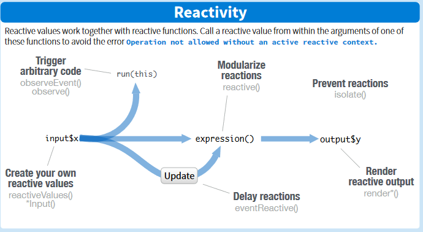

# Interaktywna wizualizacja danych z pakietem shiny: strona serwerowa

## Wstęp

Shiny to biblioteka w R pozwalająca na budowanie interaktywnych aplikacji w prosty i szybki sposób. Aplikacja Shiny składa się z dwóch części, opisywanych w dwóch osobnych plikach: interfejs użytkownika (UI), czyli jak aplikacja będzie wyglądać u użytkownika oraz sposób przetwarzania danych (serwer). W tej pracy zajmiemy się stroną serwerową Shiny.

## Serwer Shiny

Aplikacje Shiny zazwyczaj budujemy w sytuacjach, w których mamy dane, chcemy obliczyć pewne rzeczy i narysować odpowiednie wykresy. Użytkownik widzi efekt końcowy, czyli to jak zaprogramowaliśmy gdzie ma się wyświetlać wynik, natomiast w części serwerowej opisujemy jak ten wynik ma być obliczony. Jest to więc część zależna od pliku UI. 

Musimy więc w kodzie serwera zamieścić obiekty opisane w UI. Zauważmy, że tworzymy kod serwera jako funkcję od dwóch parametrów: `input, output`. W środku serwera definiujemy zależności pomiędzy `inputami` i `outputami`.

Jedną z zalet Shiny jest interaktywność. Dzięki temu użytkownik może na bieżąco zmieniać parametry i generować nowe wykresy. Jednak generowanie kodu na nowo przy każdej zmianie danych nie zawsze jest pożądane. Ważnym pojęciem przy pisaniu strony serwerowej jest reaktywność (żródło infografiki: [Shiny Cheat Sheet](https://rstudio.com/wp-content/uploads/2016/01/shiny-cheatsheet.pdf)). 

Jeśli zmienna jest reaktywna, to znaczy że jakakolwiek jej zmiana powoduje ponowne uruchomienie funkcji z nią powiązanych. Do budowania reaktywnych wyrażeń używamy funkcji `reactive()`. Taka zmienna jest liczona tylko raz i wyrażenia z nią związane używają tej wartości aż do momentu aktualizacji wybranego przez użytkownika. Z pojęciem reaktywności wiąże się kilka ważnych funkcji:

* `reactiveValues(...)`, które tworzy listą reaktywnych zmiennych,
* `isolate(expr)` - zapobiega zależności od reaktywnych zmiennych,
* `render*()` - funkcje tworzące obiekty do wyświetlenia, które zmieniają się wraz z reaktywnymi zmiennymi,
* `observeEvent(...)` - gdy nie chcemy aby model od razu się zaktualizował przy zmianie danych, a przy jakiejś określonej akcji,
* `reactive()` - tworzy reaktywne wyrażenia
* `eventReactive` - tworzy reaktywne wyrażenia, które nie zależą od wszystkich reaktywnych zmiennych, a zależą jedynie od akcji wymienionych w pierwszym argumencie.

