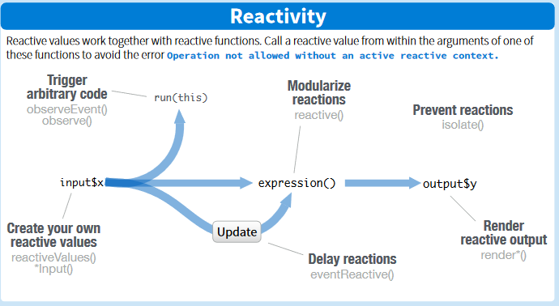

```{r setup, include=FALSE}
knitr::opts_chunk$set(echo = TRUE)
```

## Wstêp

Shiny to biblioteka w R pozwalaj¹ca na budowanie interaktywnych aplikacji w prosty i szybki sposób. Aplikacja Shiny sk³ada siê z dwóch czêœci, opisywanych w dwóch osobnych plikach: interfejs u¿ytkownika (UI), czyli jak aplikacja bêdzie wygl¹daæ u u¿ytkownika oraz sposób przetwarzania danych (serwer). W tej pracy zajmiemy siê stron¹ serwerow¹ Shiny.


## Serwer Shiny
Aplikacje Shiny zazwyczaj budujemy w sytuacjach, w których mamy dane, chcemy obliczyæ pewne rzeczy i narysowaæ odpowiednie wykresy. U¿ytkownik widzi efekt koñcowy, czyli to jak zaprogramowaliœmy gdzie ma siê wyœwietlaæ wynik, natomiast w czêœci serwerowej opisujemy jak ten wynik ma byæ obliczony. Jest to wiêc czêœæ zale¿na od pliku UI. 
Zobrazujemy to na prostym przyk³adzie danych opisuj¹cych popularnoœæ odcinków pewnego serialu (Ÿród³o: [Biecek](https://pbiecek.gitbooks.io/przewodnik/content/Programowanie/jak_tworzyc_aplikajce3.html)). Chcemy zaprezentowaæ pewien wykres wraz z tekstem w panelu, co opisujemy w kodzie UI.

```{r ui}
library(shiny)

shinyUI(fluidPage(
  titlePanel("Oceny kolejnych odcinków serialu 'Przyjaciele'"),
  sidebarLayout(
    sidebarPanel(
      p("Tutaj jest lewy panel")
    ),
    mainPanel(
      plotOutput("trend"),
      verbatimTextOutput("model")
    )
  )
))
```

Musimy wiêc w kodzie serwera zamieœciæ oba obiekty opisane w UI: `trend` i `model`. Zauwa¿my, ¿e tworzymy kod serwera jako funkcjê od dwóch argumentów: `input, output`. W œrodku serwera definiujemy zale¿noœci pomiêdzy `inputami` i `outputami`.


```{r server}
library(PogromcyDanych)
library(ggplot2)

shinyServer(function(input, output) {
  output$trend = renderPlot({
    przyjaciele <- serialeIMDB[serialeIMDB$serial == "Friends", ]

    ggplot(przyjaciele, aes(id, ocena, size=glosow, color=sezon)) +
      geom_point() + xlab("Numer odcinka")
  })

  output$model = renderPrint({
    przyjaciele <- serialeIMDB[serialeIMDB$serial == "Friends", ]

    summary(lm(ocena~id, przyjaciele))
  })
})
```


Jedn¹ z podstawowych zalet Shiny jest interaktywnoœæ, czyli u¿ytkownik mo¿e na bie¿¹co zmieniaæ parametry i generowaæ nowe wykresy. Jednak generowanie kodu na nowo przy ka¿dej zmianie danych nie zawsze jest po¿¹dane. Wa¿nym pojêciem przy pisaniu strony serwerowej jest reaktywnoœæ (Ÿród³o infografiki: [Shiny Cheat Sheet](https://rstudio.com/wp-content/uploads/2016/01/shiny-cheatsheet.pdf)). 



Jeœli zmienna jest reaktywna, to znaczy ¿e jakakolwiek jej zmiana powoduje ponowne uruchomienie funkcji z ni¹ powi¹zanych. Do budowania reaktywnych wyra¿eñ u¿ywamy funkcji `reactive()`. Taka zmienna jest liczona tylko raz i funkcje z ni¹ zwi¹zane u¿ywaj¹ tej wartoœci a¿ do momentu zmiany jej wartoœci. Z pojêciem reaktywnoœci wi¹¿e siê kila wa¿nych wyra¿eñ:

* `reactiveValues(...)`, które tworzy listê reaktywnych zmiennych
* `isolate(expr)` - zapobiega zale¿noœci od reaktywnych zmiennych
* `render*()` - funkcje tworz¹ce obiekty do wyœwietlenia, które zmieniaj¹ siê wraz z reaktywnymi zmiennymi
* `observeEvent(...)` - gdy nie chcemy aby model od razu siê zaktualizowa³ przy zmianie danych, a przy jakiejœ okreœlonej akcji
* `reactive()` - tworzy reaktywne wyra¿enia
* `eventReactive` - tworzy reaktywne wyra¿enia, które nie zale¿¹ od wszystkich reaktywnych zmiennych, a zale¿¹ jedynie od akcji wymienionych w pierwszym argumencie

 Tak jak na widocznym przyk³adzie poni¿ej (Ÿród³o: [Biecek](https://pbiecek.gitbooks.io/przewodnik/content/Programowanie/jak_tworzyc_aplikajce3.html)), zosta³a u¿yta funkcja `reactive()` do wybrania konkretnego serialu i nastêpnie u¿yto jej wewn¹trz funkcji `renderPrint()`.

 

```{r przyklad}
library(PogromcyDanych)
library(ggplot2)

shinyServer(function(input, output, session) {
  tylkoWybranySerial <- reactive({
    serialeIMDB[serialeIMDB$serial == input$wybranySerial, ]
  })

  output$listaOdcinkow <- renderUI({ 
    serial <- tylkoWybranySerial()

    selectInput("odcinki", "Odcinki w serialu", as.character(serial$nazwa) )
  })

  output$trend = renderPlot({
    serial <- tylkoWybranySerial()

    pl <- ggplot(serial, aes(id, ocena, size=glosow, color=sezon)) +
      geom_point() + xlab("Numer odcinka")
    if (input$liniaTrendu) {
      pl <- pl + geom_smooth(se=FALSE, method="lm", size=3)
    }
    pl
  })

  output$model = renderPrint({
    serial <- tylkoWybranySerial()

    summary(lm(ocena~id, serial))
  })
})
```